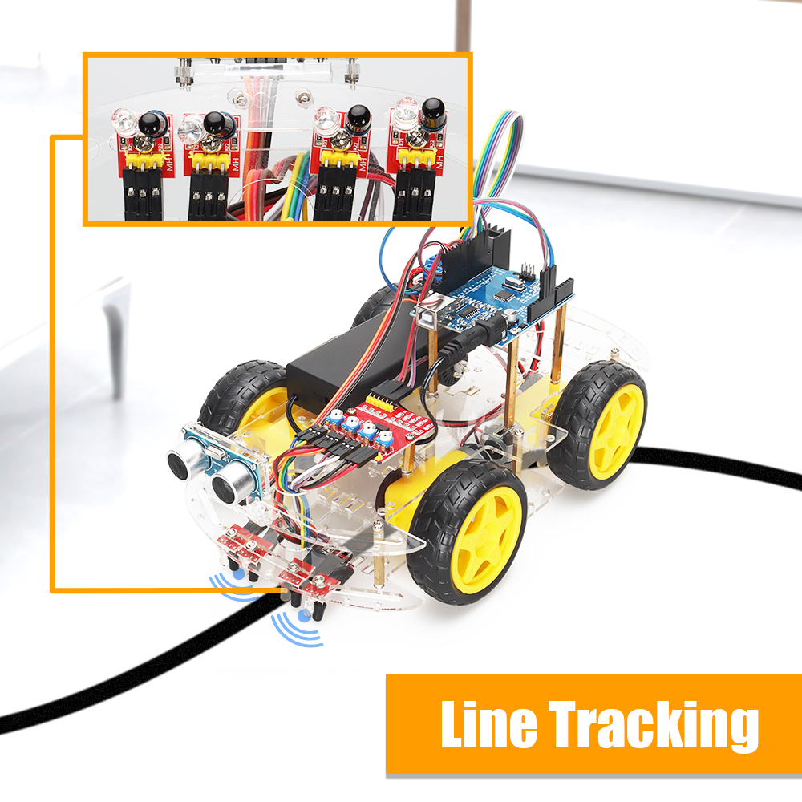

# Four way tracking car for Rabbit board Supports mind+ programming
<h3 align="right">ZYC0106</h3>

# Introduction to the tutorial
This tutorial includes the file content shown in the figure below to help you learn more about the car kit and programming knowledge:

"1_Get_start": This folder stores the robot assembly guide and necessary software environment files, etc. In order to complete the assembly accurately and quickly, please be sure to review it in detail and assemble it according to the manual. At the same time, please review the PDF files in this folder to create the software environment correctly.
"2_Arduino_Code": This folder is used to store Arduino code files, upload the codes to the control board for use, each code function is independent, each time a code is uploaded, the code uploaded later will overwrite the previous code;
After completing the assembly of the car and the creation of the environment, follow this tutorial to gradually complete the program burning of the smart car and realize different functions!